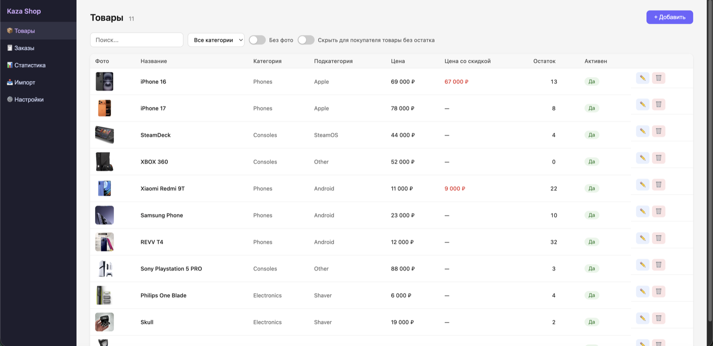

# Kaza Shop

Интернет-магазин «под ключ» на базе **Telegram-бота**: покупатели выбирают товары и оформляют заказы прямо в Telegram, а продавец управляет каталогом, заказами и настройками через веб-панель администратора.

Проект состоит из трёх сервисов:

- **API (FastAPI)** — бэкенд, база данных, бизнес-логика каталога, заказов, статистики;
- **Telegram-бот (aiogram 3)** — витрина магазина для покупателей;
- **Панель продавца (React + Vite)** — веб-интерфейс для управления магазином.

---

## Содержание

- [Возможности](#возможности)
- [Технологический стек](#технологический-стек)
- [Структура проекта](#структура-проекта)
- [Установка на сервер](#установка-на-сервер)
- [Запуск через Docker Compose](#запуск-через-docker-compose)
- [Переменные окружения](#переменные-окружения)
- [Обслуживание](#обслуживание)
- [Локальная разработка](#локальная-разработка)

---


**Каталог товаров** в панели продавца:



---

## Возможности

### Панель продавца (`seller-panel`)

- **Товары** — каталог с категориями и подкатегориями, ценой и ценой со скидкой, остатками, до 3 фото на товар, характеристиками, флагом «активен» (показывать в боте), фильтры «без фото» и «скрыть товары без остатка».
- **Заказы** — список заказов с покупателем, суммой и статусом; смена статуса (Новый → Оплачен → Подтверждён → Собран → Отправлен → Получен, а также Отменён / Возврат); печать чека по заказу.
- **Статистика** — выручка, количество заказов, средний чек, разбивка по статусам, фильтр по датам, экспорт в Excel.
- **Импорт** — массовая загрузка/обновление каталога из `.xlsx` (колонки `category`, `subcategory`, `name`, `price`, `discount_price`, `description`, `characteristics`, `stock`, `is_active`).
- **Настройки** — название магазина, приветственное сообщение бота, контакт продавца, Telegram ID для уведомлений о заказах, факсимиле (печать) и QR-код для оплаты, FAQ для бота, смена логина/пароля админа, системный журнал (проверка состояния, сброс кэша каталога, скачивание логов).

### Telegram-бот (`app/bot`)

- Каталог товаров с фото, ценой, остатком и характеристиками, навигация по категориям/подкатегориям.
- Корзина: добавление, изменение количества, удаление позиций.
- Оформление заказа с указанием адреса доставки (или без него) и оплатой по QR-коду.
- Раздел «Мои заказы»: активные заказы и история покупок.
- Автоматические уведомления покупателю при смене статуса заказа.
- FAQ и кнопка быстрой связи с продавцом.

### API (`app/api`)

REST API на FastAPI с роутами для аутентификации, каталога, корзины, заказов, импорта, статистики, настроек и пользователей; хранит данные в PostgreSQL, кэширует каталог бота через Redis.

---

## Технологический стек

| Слой | Технологии |
|---|---|
| Backend | Python, FastAPI, SQLAlchemy 2.0 (async), Alembic, PostgreSQL, Redis |
| Telegram-бот | aiogram 3, Redis (FSM-хранилище) |
| Панель продавца | React 18, Vite |
| Прочее | Pandas/openpyxl (импорт из Excel), ReportLab (чеки/PDF), Pillow, qrcode |
| Инфраструктура | Docker, Docker Compose, Nginx |

---

## Структура проекта

```
app/
  api/            # FastAPI-роуты и Pydantic-схемы
  bot/            # Telegram-бот (handlers, keyboards, states, services)
  core/           # конфигурация, middleware
  db/             # engine, сессии, миграции
  models/         # SQLAlchemy-модели
  services/       # бизнес-логика (заказы, товары, импорт, статистика, чеки...)
alembic/          # миграции БД
seller-panel/     # веб-панель продавца (React + Vite)
nginx/            # конфигурация Nginx
install.sh        # интерактивный установщик на сервер
deploy.sh         # деплой обновлений с локальной машины на сервер
update.sh         # обновление сервиса на сервере
backup.sh         # бэкап БД и медиафайлов
restore.sh        # восстановление из бэкапа
healthcheck.sh    # мониторинг сервисов (cron)
docker-compose.yml
docker-compose.prod.yml
```

---

## Установка на сервер

Для чистого сервера (Ubuntu/Debian) есть интерактивный установщик, который настраивает Docker, Nginx, генерирует секреты и поднимает все сервисы:

```bash
bash install.sh
```

В процессе установки нужно будет указать:

- токен Telegram-бота (`BOT_TOKEN`, выдаётся [@BotFather](https://t.me/BotFather));
- Telegram ID администратора (`ADMIN_TG_ID`, можно узнать у [@userinfobot](https://t.me/userinfobot));
- домен или IP-адрес сервера.

Пароли БД, `SECRET_KEY` и токен внутреннего API генерируются автоматически.

Дальнейшее обновление уже установленного проекта — через `update.sh` (на сервере) или `deploy.sh` (с локальной машины, с автоматическим бэкапом и откатом при ошибке).

---

## Запуск через Docker Compose

Для локального запуска/разработки:

```bash
cp .env.example .env   # заполните переменные окружения (см. ниже)
docker compose up -d --build
```

Сервисы после запуска:

- API — `http://localhost:8000` (Swagger `/docs`, недоступен в production);
- панель продавца — `http://localhost:5173`;
- бот — фоновый процесс, обращается к API и Redis.

---

## Переменные окружения

Основные переменные (`app/core/config.py`, задаются в `.env`):

| Переменная | Назначение |
|---|---|
| `env` | окружение: `development` / `production` |
| `db_user`, `db_password`, `db_host`, `db_port`, `db_name` | подключение к PostgreSQL |
| `secret_key` | секрет для подписи JWT-токенов админки |
| `admin_password` | пароль администратора панели |
| `bot_token` | токен Telegram-бота |
| `admin_tg_id` | Telegram ID для уведомлений о заказах |
| `bot_api_token` | токен для служебного взаимодействия бота с API |
| `redis_url` | адрес Redis (FSM-хранилище бота, кэш каталога) |
| `alert_bot_token`, `alert_chat_id` | бот и чат для алертов мониторинга |
| `domain`, `cors_origins` | домен проекта и разрешённые CORS-источники |
| `timezone` | таймзона для дат в отчётах/экспорте |
| `backup_keep_days` | сколько дней хранить бэкапы |
| `log_level` | уровень логирования |

---

## Обслуживание

| Скрипт | Назначение |
|---|---|
| `backup.sh` | бэкап БД и медиафайлов (`--hourly`, `--silent`, `--emergency`) |
| `restore.sh` | восстановление из архива бэкапа |
| `healthcheck.sh` | проверка состояния сервисов (запускается по cron каждые 5 минут) |
| `update.sh` | обновление сервиса на сервере |
| `configure-updates.sh` | настройка канала обновлений |
| `deploy.sh` | деплой изменений с локальной машины на сервер с бэкапом и автооткатом |
| `setup-nginx.sh` | настройка Nginx для проекта |

---

## Локальная разработка

**Backend / бот:**

```bash
pip install -r requirements.txt
uvicorn app.main:app --reload          # API
python -m app.bot.bot                  # бот (в отдельном терминале)
```

**Панель продавца:**

```bash
cd seller-panel
npm install
npm run dev
```
